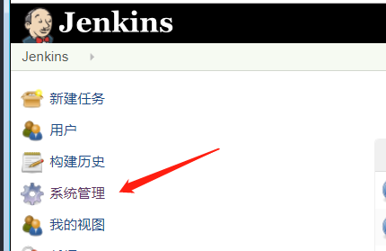
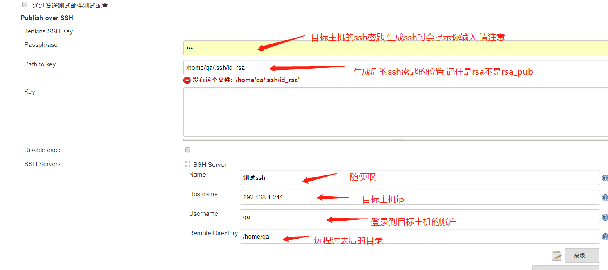
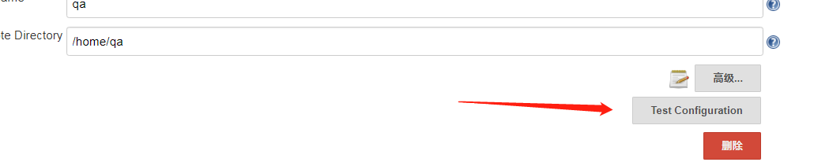

# 简介
> publish over ssh是jenkins上一个插件,可以在jenkins系统管理->插件管理->可选插件中搜索到,然后安装,其主要的作用就是用于,远程登录到目标主机上.并且可以在目标主机上执行一些脚本.

# 如何做到远程持续集成.

---
## 场景
> 我们的java项目在Jenkins上编译打包,可是我们想让Jenkins上打包出来的程序在另一台机器上执行,那么我们如何做到呢,首先你总得ssh到目标机器上,然后执行相应的脚本吧,所以我们用到了 <font color=red>publish over ssh</font> 我们需要在jenkins上安装这个插件.

# 安装插件
>点击系统管理



> 点击插件管理


> 搜索插件,并安装


>下载好插件后,进入到系统管理中的系统设置中,然后往下拉,找到 Publish over SSH这一栏进行配置



## 如何生存ssh密匙

> 如果需要jenkins远程登录到目标主机,需要在目标主机对应的用户下面生存ssh密匙

1. 首先检查该用户有没有生成过ssh密匙

```sh
#如果发现有存在 .ssh目录就不需要生成了,可以直接用
ls -al ~/

#如果不存在执行以下命令生成
ssh-keygen -t rsa -C "xxxx@email.com"
```
2. 使用 ls -al ~/ 就能看到生成的ssh密匙了,将对应的目录配置到jenkins上就行了

> 执行TestConfiguration测试ssh是否成功生效,如果不成功,请检查ssh配置是否有误(基本没有任何问题这一步)



> 到此安装和配置ssh结束,接下来要具体配置我们的jenkins job,让他去使用ssh做持续集成
