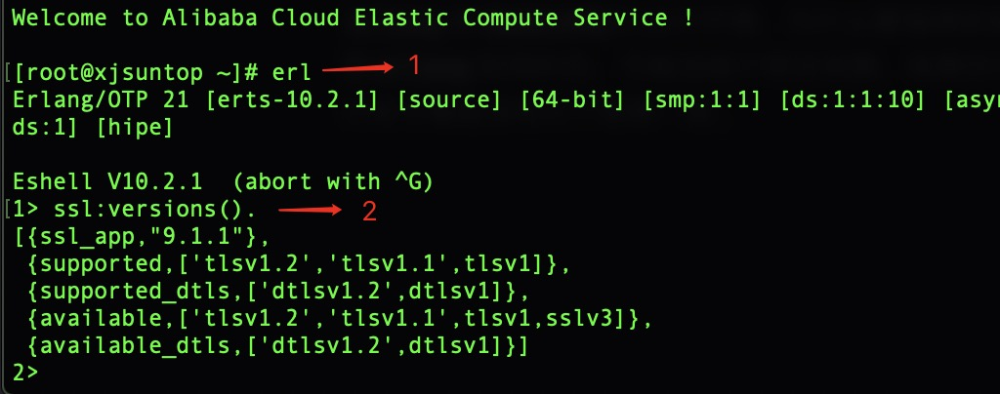
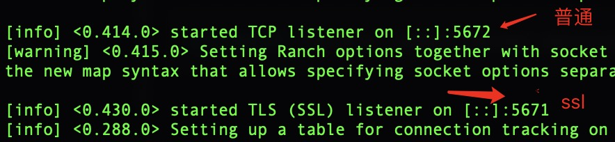
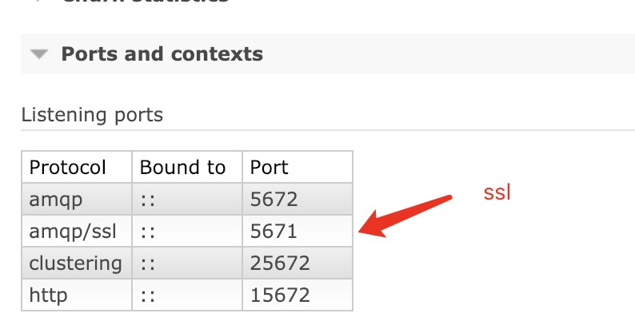

title: RMQ的SSL配置最佳实践
date: 2019-01-09 18:18:00
tags:
  - RabbitMQ
  - SSL
  - Erlang
---
网上的各种文章不是很细，配置出了问题很难发现解决，我已经踩了很多坑，结合网上些文章，以及官网网站给出的例子，最终整理出了一套自己的配置模式，参考本章即可不出任何错误的完成`RabbitMQ`的`SSL`配置。
<!-- more -->

## Erlang语言的安装
`erlang`是`RabbitMQ`的运行环境，为什么要强调安装`erlang`,如果你随便去下载`erlang`官网的包，可能会缺少很多依赖，如果你已经安装好了`erlang`，执行命令看是否和以下结果一致。

如果执行后有error，没有supported输出，请重新安装
### 重装erlang
在`RabbitMQ`官方网站有一段话，说明了ssl环境需要erlang哪些扩展包。原地址：[RMQ官方SSL说明](https://www.rabbitmq.com/ssl.html)
> Erlang/OTP Requirements for TLS Support
In order to support TLS connections, RabbitMQ needs TLS and crypto-related modules to be available in the Erlang/OTP installation. The recommended Erlang/OTP version to use with TLS is the most recent supported Erlang release. Earlier versions, even if they are supported, may work for most certificates but have known limitations (see below).

> The Erlang asn1, crypto, public_key, and ssl libraries (applications) must be installed and functional. On Debian and Ubuntu this is provided by the erlang-asn1, erlang-crypto, erlang-public-key, and erlang-ssl packages, respectively. The zero dependency Erlang RPM for RabbitMQ includes the above modules.

> If Erlang/OTP is compiled from source, it is necessary to ensure that configure finds OpenSSL and builds the above libraries.

大概意思是安装`erlang`前你的系统中必须已经安装了`openssl`，然后`erlang`开启ssl需要哪些依赖包，最终他给了一个0依赖的`erlang`下载地址，这个`erlang`包他默认包含了所有ssl需要的依赖。然后他给出的`erlang`和`RabbitMQ`的版本对比，下载你需要的版本.
1. [erlang版本参考地址](https://www.rabbitmq.com/which-erlang.html)
2. [0依赖的erlang下载](https://github.com/rabbitmq/erlang-rpm/releases)

> rpm安装过后，将erl命令地址配置到环境变量中，如果在重装过程中遇到了文件冲突，使用如下指令。
```shell
rpm -Uivh erlang.rpm --replacefiles
```

`erlang`环境装好后，`RabbitMQ`安装就不再介绍，使用rpm安装就行，没有什么坑。

## 配置RabbitMQ的SSL端口

> 接下来会简述证书生成，ssl端口开放

### 下载SSL证书生成器

```shell
git clone https://github.com/Berico-Technologies/CMF-AMQP-Configuration.git
```
### 生成证书
```shell
cd CMF-AMQP-Configuration/ssl
```
配置当前目录下的`openssl.cnf`,基本上不需要改动，证书默认生成后的有效期是一年，如果需要延长可以修改`default_days = 365`.

### 生成证书签发机构
该脚本是会在当前目录下生成一个ca目录，里面存放着一些证书颁发机构信息，和已经签发的证书记录
```shell
sh setup_ca.sh RabbitSSL  
```
1. `RabbitSSL`: 签发机构名称，自定义。

### 生成服务端公钥，和私钥
该脚本是会在当前目录下生成一个server目录,里面存放着服务端的公钥，和私钥文件。该文件生成后会在ca目录文件中有签发记录。
```shell
sh make_server_cert.sh rabbit-server rabbit
```
1. `rabbit-server`: 生成的密钥前缀名，自定义。
2. `rabbit`: 访问该密钥的密码，自定义。

### 生成客户端公钥，和私钥
该脚本是会在当前目录下生成一个client目录，里面存放着客户端的公钥，和私钥文件。该文件生成后会在ca目录文件中有签发记录。
```shell
sh create_client_cert.sh rabbit-client rabbit
```
1. `rabbit-client`: 生成的密钥前缀名，自定义。
2. `rabbit`: 访问该密钥的密码，自定义。

### 生成客户端需要的证书
不同的语言操作方式不一样，这里我们使用的是`java`语言，使用`java`的`keytool`工具生成，首先确保已经安装`java`并且在环境变量中已经配置
```shell
keytool -import -alias rabbit-server -file server/rabbit-server.cert.pem -keystore rabbitStore -storepass rabbit
```

> 用服务端的公钥生成证书，这个步骤很关键，该证书用于客户端和服务端通信。
>> server/rabbit-server.cert.pem: 上个步骤已经生成好的服务端公钥

如果需要删除已经生成的证书，可执行以下命令

```shell
keytool -delete -alias rabbit-server -keystore rabbitStore -storepass rabbit
```

### 证书生成结束步骤检查
如果你跟着文章一步一步做到这，说明你离成功就只差最后一步了，接下来检查我们前几个步骤的结果，经过几个步骤我们在CMF-AMQP-Configuration/ssl/目录下生成了：
- ca
- server
- client
- rabbitStore 证书

如果以上的几个目录和这个证书都存在，说明该大步骤已经完美结束。接下来进入最关键的一步了。

## 修改RabbitMQ的SSL配置
> 接下来的步骤就比较关键了，需要用到我们上面所有生成的文件，将它们配置到`RabbitMQ`的`config`文件中.

1. 将`ca`,`server`,`client`,`rabbitStore`拷贝到`/etc/rabbitmq`目录下
```shell
cp -r ca server client rabbitStore /etc/rabbitmq/ssl
```

2. 如果`/etc/rabbitmq`目录下没有`rabbitmq.config`,创建该文件。
```shell
vim /etc/rabbitmq/rabbitmq.config
```
3. 将以下配置复制到`rabbitmq.config`中

```shell
%%Disable SSLv3.0 and TLSv1.0 support.
[
    {ssl, [{versions, ['tlsv1.2', 'tlsv1.1']}]},
    {rabbit, [
        {tcp_listeners, [5672]},
        {ssl_listeners, [5671]},
        {ssl_options, [{cacertfile,"/etc/rabbitmq/ssl/ca/cacert.pem"},
            {certfile,"/etc/rabbitmq/ssl/server/rabbit-server.cert.pem"},
            {keyfile,"/etc/rabbitmq/ssl/server/rabbit-server.key.pem"},
            {verify, verify_peer},
            {ciphers, ["ECDHE-ECDSA-AES256-GCM-SHA384","ECDHE-RSA-AES256-GCM-SHA384",
                        "ECDHE-ECDSA-AES256-SHA384","ECDHE-RSA-AES256-SHA384", "ECDHE-ECDSA-DES-CBC3-SHA",
                        "ECDH-ECDSA-AES256-GCM-SHA384","ECDH-RSA-AES256-GCM-SHA384","ECDH-ECDSA-AES256-SHA384",
                        "ECDH-RSA-AES256-SHA384","DHE-DSS-AES256-GCM-SHA384","DHE-DSS-AES256-SHA256",
                        "AES256-GCM-SHA384","AES256-SHA256","ECDHE-ECDSA-AES128-GCM-SHA256",
                        "ECDHE-RSA-AES128-GCM-SHA256","ECDHE-ECDSA-AES128-SHA256","ECDHE-RSA-AES128-SHA256",
                        "ECDH-ECDSA-AES128-GCM-SHA256","ECDH-RSA-AES128-GCM-SHA256","ECDH-ECDSA-AES128-SHA256",
                        "ECDH-RSA-AES128-SHA256","DHE-DSS-AES128-GCM-SHA256","DHE-DSS-AES128-SHA256",
                        "AES128-GCM-SHA256","AES128-SHA256","ECDHE-ECDSA-AES256-SHA",
                        "ECDHE-RSA-AES256-SHA","DHE-DSS-AES256-SHA","ECDH-ECDSA-AES256-SHA",
                        "ECDH-RSA-AES256-SHA","AES256-SHA","ECDHE-ECDSA-AES128-SHA",
                        "ECDHE-RSA-AES128-SHA","DHE-DSS-AES128-SHA","ECDH-ECDSA-AES128-SHA",
                                                "ECDH-RSA-AES128-SHA","AES128-SHA"]},
            {honor_cipher_order, true},
            {fail_if_no_peer_cert, true},
            {versions, ['tlsv1.2', 'tlsv1.1']}
        ]},
        {auth_mechanisms,['PLAIN', 'AMQPLAIN', 'EXTERNAL']}
    ]}
].
```
在以上配置中我们将证书颁发机构以及服务端的公钥和私钥配置进去了。`client`目录和`rabbitStore`是给客户端使用的，我们使用`5671`端口作为我们ssl通信端口，`5672`保持不变，继续为内网tcp提供服务


4. 重启rabbitmq服务

> 以下命令是参考，每个人服务安装方式不一样，总之将它重启就可以

```shell
systemctl restart rabbit-server.service
```

5. 查看rabbitmq日志输出

```shell
less /var/log/rabbitmq/xxx.log
```

> log显示成这样，代表ssl开启成功





> 或者访问网页查看`5671`是否开启ssl



<font color=red>如上，ssl服务已经开启.最后一步代码测试</font>

## 编写Java代码测试证书授权
> 将前面还没有用到的`client`目录和`rabbitStore`证书拷贝的项目中，放入到resource目录下，执行以下代码做测试；

```Java
public class SslReceiver {

    public static void main(String[] args) throws TimeoutException {
        String classpath = SslReceiver.class.getResource("/").getPath();
        //证书密码
        char[] sslPwd = "rabbit".toCharArray();
        //读取client密钥，和rabbitStore证书
        try (InputStream sslCardStream = new FileInputStream(classpath + "keyStore/client/rabbit-client.keycert.p12");
             InputStream rabbitStoreStream = new FileInputStream(classpath + "keyStore/rabbitStore")) {

            //加载秘钥
            KeyStore ks = KeyStore.getInstance("PKCS12");
            ks.load(sslCardStream, sslPwd);
            KeyManagerFactory keyManagerFactory = KeyManagerFactory.getInstance("SunX509");
            keyManagerFactory.init(ks, sslPwd);

            //读取授权证书，只含有服务端的公钥
            KeyStore jks = KeyStore.getInstance("JKS");
            jks.load(rabbitStoreStream, sslPwd);
            TrustManagerFactory keyStoreManager = TrustManagerFactory.getInstance("SunX509");
            keyStoreManager.init(jks);
            SSLContext context = SSLContext.getInstance("TLSv1.2");
            context.init(keyManagerFactory.getKeyManagers(), keyStoreManager.getTrustManagers(), null);
            ConnectionFactory factory = new ConnectionFactory();
            factory.setUsername("rabbitTest");
            factory.setPassword("123456");
            factory.setHost("127.0.0.1");
            factory.setPort(5671);
            factory.setAutomaticRecoveryEnabled(true);

            //设置sslContext
            factory.useSslProtocol(context);
            Connection connection = factory.newConnection();
            Channel channel = connection.createChannel();
            channel.queueDeclare("rabbitmq-queue", false, true, true, null); //rabbitmq-queue是rabbitmq队列
            channel.basicPublish("", "rabbitmq-queue", null, "Test,Test".getBytes());
            GetResponse chResponse = channel.basicGet("rabbitmq-queue", false);
            if (chResponse == null){
                System.out.println("No message retrieved");
            }else {
                byte[] body = chResponse.getBody();
                System.out.println("Recieved: " + new String(body));
            }
            channel.close();
            connection.close();
        } catch (KeyStoreException | UnrecoverableKeyException | KeyManagementException
                | CertificateException | NoSuchAlgorithmException | IOException e) {
            log.error("SSL证书解析失败", e);
        }
    }
}
```

如果收到了那条消息，到此ssl结束，如果有异常信息，请在启动jvm中传递参数
`-Djavax.net.debug=all`,查看连接过程，在结合服务端`/var/log/rabbitmq`下的log一起分析，或者联系我！通常来讲，如果你将我的每一步复制，不可能出现问题。
完结！
